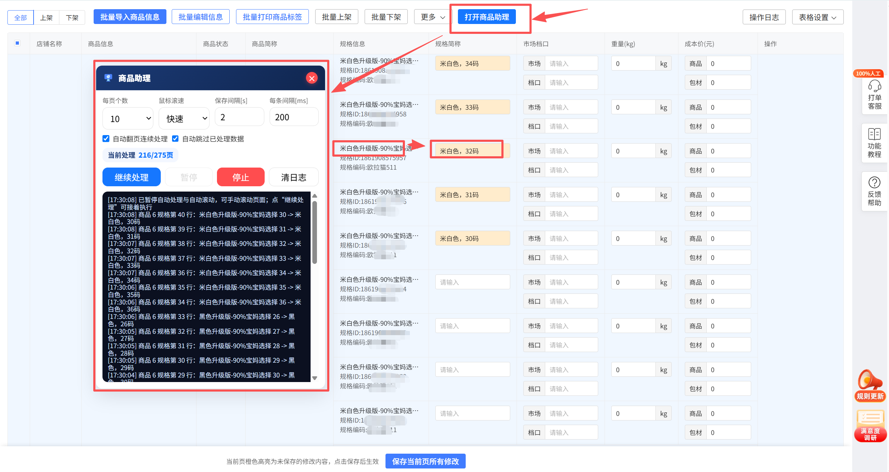

# PDD Goods Assistant

一个用于拼多多商家后台商品信息批量处理的 Chrome 插件。

这个插件主要服务于 `https://mms.pinduoduo.com/print/goods-setting` 页面，核心目标是帮助商家或运营同学更高效地批量填写商品规格简称，减少重复手工输入，同时尽量保留鞋类商品中对采购、识别、上架有实际意义的属性信息。

## 适用场景

当你在拼多多后台批量维护商品规格简称时，经常会遇到这些情况：

- 一个商品下面有很多规格，手工逐条填写很慢
- 规格名中既有颜色、尺码，也夹杂属性词、营销词、括号说明
- 页面是异步加载和虚拟渲染，滚动、翻页、展开规格都比较麻烦
- 部分商品是特殊商品，比如补差价商品、单规格商品，不适合按普通逻辑处理

这个插件就是为这类场景做的辅助工具。

## 当前功能

### 自动识别并填写规格简称

插件会从规格信息中提取出更适合填写到“规格简称”的内容，并自动写入输入框。

目前已经兼容的典型情况包括：

- 鞋类尺码：
  - `粉色网面 37` → `粉色网面，37码`
  - `米色 29内长约18.2cm` → `米色，29码`
  - `绿色 34码内长20.5cm` → `绿色，34码`
- 服装尺码：
  - `白杏色 XL` → `白杏色，XL`
  - `黑色 2XL` → `黑色，2XL`
  - `米白 均码` → `米白，均码`
- 括号属性保留：
  - `蓝色【网面】 31` → `蓝色网面，31码`
  - `黑色（加绒） 28` → `黑色加绒，28码`

### 保留鞋子本身的重要属性

插件不会把这类对采购或商品识别有意义的属性误删：

- `网面`
- `皮面`
- `革面`
- `加绒`
- `加棉`
- `加厚`

例如：

- `黑色皮面 36` 不会变成 `黑色，36码`
- 会保留为 `黑色皮面，36码`

### 自动清理无意义修饰词和营销词

插件会尽量去掉与商品本身属性无关、只是营销或区分用途的词，例如：

- `传统材料款`
- `材料款`
- `材质款`
- `基础款`
- `经典款`
- `专业版`
- `豪华版`
- `升级版`
- `90%宝妈选择`
- `81%宝妈选择`
- `-FS-`

例如：

- `银色传统材料款 27` → `银色，27码`
- `蓝色升级版-90%宝妈选择 32码内长19.5cm` → `蓝色，32码`

### 自动展开规格

对于一个商品下存在“展开全部规格”的情况，插件会尝试自动展开后再处理，避免只处理到当前已经渲染出来的部分规格。

### 自动保存

每处理完一个商品分组后，插件会判断是否真的发生了输入内容修改：

- 如果本组有实际改动，会点击页面上的“保存当前页所有修改”
- 如果本组没有实际改动，则跳过保存，避免频繁触发“没有新数据要保存”的页面提示

### 自动翻页连续处理

开启后，插件会在当前页处理结束后自动翻到下一页，并继续处理。

### 自动跳过已处理数据

开启后，如果某个商品下的规格简称已经全部是目标值，插件会直接跳过，不再重复填写和保存。

### 特殊商品跳过

插件已经对部分“补差价专用商品”做了跳过处理。这类商品通常具有下面的特征：

- 单规格
- 无需正常展开
- 文案中包含 `补收差价专用商品`、`补差价专用商品`、`联系客服确认`
- 商品编码或规格编码为 `--`

遇到这类商品时，插件会直接记为完成，避免卡在当前页一直寻找“最后一个商品”。

### 支持人工干预

插件面板提供暂停能力：

- 点击 `暂停` 后，会停止自动滚动和自动处理
- 你可以自己手动滚动页面，把商品滚出来
- 再点击 `继续处理`，插件会保留当前进度继续执行

这个功能非常适合页面异步加载不稳定、需要手工辅助滚动时使用。

## 面板参数说明

插件面板目前支持以下参数：

### `每页个数`

可选值：

- `10`
- `20`
- `50`
- `100`
- `200`

这个参数用于告诉插件当前页理论上应该有多少个商品。默认是 `10`。  
在非最后一页的情况下，插件会尽量以这个数量作为“本页完成”的判断依据。

### `鼠标滚速`

可选值：

- `普通`
- `中速`
- `快速`

默认是 `中速`。

含义如下：

- `普通`：当前滚动速度的 `75%`
- `中速`：当前滚动速度的 `100%`
- `快速`：当前滚动速度的 `150%`

这个参数会影响插件自动寻找剩余商品时的滚动步长。

### `保存间隔[s]`

每次点击“保存当前页所有修改”后，插件会暂停指定秒数，再继续后续动作。

适合页面保存响应较慢的情况，避免点完保存马上继续操作。

### `每条间隔[ms]`

每处理一条规格时的间隔，单位是毫秒。

如果页面较卡、表单响应慢，可以适当把这个值调大一些。

### `自动翻页连续处理`

开启后，当前页处理完成会自动翻页并继续。

关闭后，只处理当前页。

### `自动跳过已处理数据`

开启后，已经填写好的规格简称不会重复填写。

## 面板按钮说明

### `开始处理`

- 空闲状态下：开始一个新任务
- 暂停状态下：继续当前任务

### `暂停`

暂停自动处理和自动滚动，方便你手工干预页面。

### `停止`

停止当前任务，不再继续执行。

### `清日志`

清空面板内的运行日志显示。

## 页码状态显示

面板中会显示：

- `当前处理 187/273页`

含义是：

- 当前正在处理第 `187` 页
- 当前总页数为 `273` 页

方便你在长时间运行时观察进度。

## 安装方法

### 方式一：本地加载已解压扩展

1. 下载或克隆本仓库到本地
2. 打开 Chrome，进入 `chrome://extensions/`
3. 打开右上角 `开发者模式`
4. 点击 `加载已解压的扩展程序`
5. 选择当前项目根目录，也就是包含 `manifest.json` 的目录

加载成功后，插件就会出现在浏览器扩展列表中。

### 方式二：更新本地开发版本

如果你已经加载过一次，代码有更新后：

1. 回到 `chrome://extensions/`
2. 找到 `PDD Goods Assistant`
3. 点击 `重新加载`
4. 再刷新拼多多页面即可

## 使用方法

### 1. 打开目标页面

进入拼多多商家后台商品信息页面：

- `https://mms.pinduoduo.com/print/goods-setting`

注意：当前插件只针对这个页面生效。

### 2. 打开插件面板

页面上会出现一个蓝底白字按钮：

- `打开商品助理`

点击后会弹出面板。

### 3. 设置参数

建议至少确认以下参数：

- `每页个数`
- `鼠标滚速`
- `保存间隔`
- `每条间隔`

如果你想一页一页手动确认，就关闭：

- `自动翻页连续处理`

如果你是断点续跑，建议打开：

- `自动跳过已处理数据`

### 4. 点击开始处理

插件会开始：

1. 识别当前页商品
2. 展开规格
3. 提取规格简称
4. 写入输入框
5. 在有实际修改时执行保存
6. 根据配置决定是否自动翻页

### 5. 观察日志

面板下方会显示详细日志，包括：

- 当前页扫描状态
- 当前处理商品 ID
- 是否成功展开规格
- 每条规格的填写结果
- 是否保存
- 是否发现新商品
- 是否翻页成功

### 6. 遇到页面加载异常时

如果你发现页面异步加载不稳定，或者商品没有完全渲染出来：

1. 点击 `暂停`
2. 手动滚动页面，把商品列表滚出来
3. 点击 `继续处理`

这是当前最稳的人工干预方式。

## 自动滚动逻辑说明

为了适应拼多多页面的异步加载与虚拟列表渲染，插件当前采用了以下策略：

1. 翻页成功后，先把滚动条拉回顶部
2. 开始处理当前页前，再执行一次回到顶部
3. 如果还没找到足够数量的商品，插件会自动向下滚动
4. 到底后会回到顶部，再继续扫描
5. 支持通过 `鼠标滚速` 调节自动滚动强度

这样做的目的，是尽量模拟人工滚动页面触发加载的过程。

## 目录结构

- `manifest.json`：Chrome Extension Manifest v3 配置
- `src/background.js`：后台 Service Worker
- `src/content.js`：核心逻辑，注入到拼多多页面执行
- `src/pdd.png`：插件面板图标
- `src/popup/`：扩展弹窗页面
- `src/options/`：扩展设置页
- `src/shared/storage.js`：本地存储封装

## 适配页面

当前仅对以下页面生效：

- `https://mms.pinduoduo.com/print/goods-setting*`

如果后续拼多多后台页面 DOM 结构发生较大变化，插件中的选择器和逻辑可能需要同步调整。

## 已知限制

为了方便开源使用，这里也把当前版本的一些限制说明清楚：

- 页面高度依赖异步加载，偶尔仍可能需要人工暂停后滚动辅助
- 拼多多后台 DOM 结构如果变化，展开、翻页、保存、字段识别可能失效
- 目前主要针对鞋类和部分服装类规格简称处理做了优化
- 某些非常特殊的商品命名规则，仍可能需要继续补充清理词或保留词

## 常见建议

### 建议先小范围验证

第一次使用时，建议：

- 先关闭自动翻页
- 先跑 1 页
- 看看生成的简称是否符合你团队的实际标准

确认没问题后，再开启连续翻页批量执行。

### 建议开启“自动跳过已处理数据”

如果你有断点继续处理的需求，这个选项很实用，可以减少重复写入和无效保存。

### 页面异常时优先使用暂停

如果发现：

- 商品数量一直不对
- 商品没有完全加载
- 页面滚动不稳定

优先点击 `暂停`，自己滚动页面，再点击 `继续处理`。

## 开发说明

### 本地调试

1. 修改代码
2. 回到 `chrome://extensions/`
3. 点击插件的 `重新加载`
4. 刷新目标页面
5. 再次打开面板测试

### 主要逻辑入口

如果你要继续二次开发，可以优先看这些位置：

- `src/content.js`
  - 面板 UI 注入
  - 商品扫描与滚动逻辑
  - 展开规格逻辑
  - 规格简称提取逻辑
  - 自动保存与翻页逻辑

## 免责声明

本插件仅用于提高日常运营效率，请在自己的业务流程中先小范围验证，再批量使用。  
由于平台页面结构、异步加载方式、表单交互逻辑可能变化，使用前请自行确认当前页面仍与本插件适配。
